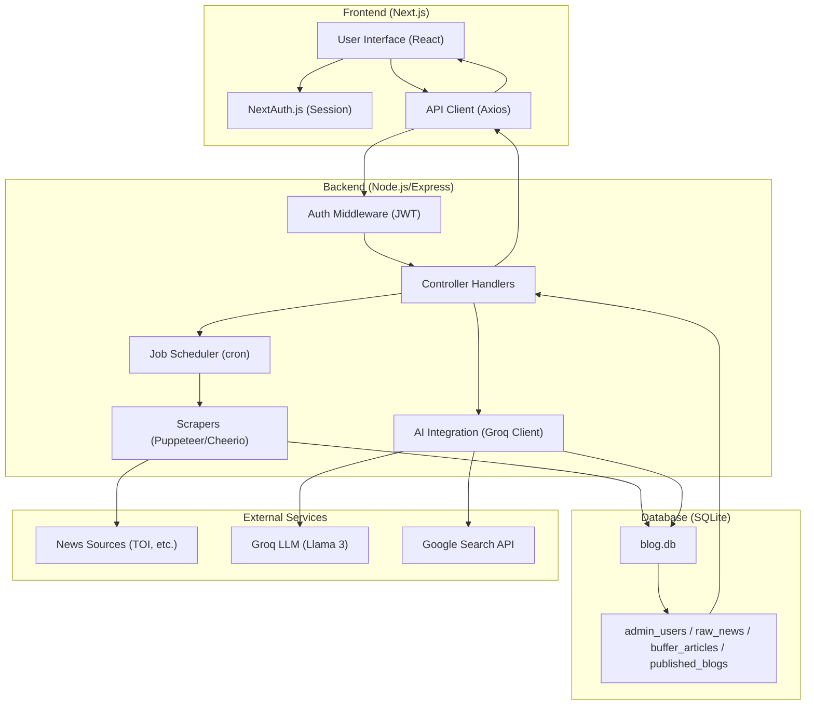

# AI Blog Platform

An intelligent platform for automating blog content generation, curation, and publishing. This platform leverages modern AI (Groq/OpenAI) and web scraping technologies to streamline the content creation process.

---

## 📽️ Project Overview
**Tanuja AI Hub** is a full-stack AI-powered blogging solution. It allows users to automate the research, writing, and publishing of high-quality blog posts. By integrating advanced LLMs and robust web scraping, it reduces the time spent on content ideation and drafting from hours to seconds.

## 🏗️ Project Architecture & Workflow
The system follows a classic **Client-Server-Database** architecture with an added **AI/Job** layer for asynchronous processing.

### **System Architecture Diagram:**



### **Step-by-Step Workflow:**
1.  **User Access:** User visits the Next.js frontend and authenticates via NextAuth.
2.  **Request Generation:** User provides a topic or URL for a blog post.
3.  **API Communication:** The Frontend sends a request to the Node.js Backend API.
4.  **Data Processing & Scraping:**
    *   If a URL is provided, the backend uses **Puppeteer/Cheerio** to scrape the content.
    *   The raw data is cleaned and prepared for the AI.
5.  **AI Content Generation:**
    *   The backend triggers the **Groq API** (using Llama 3 models) to process inputs.
    *   AI generates a structured, SEO-optimized blog post based on custom prompts.
6.  **Database Storage:** The generated blog, metadata, and user settings are stored in **SQLite** via `better-sqlite3`.
7.  **Result Retrieval:** The Frontend fetches the stored blog and displays it to the user with full Markdown support.

---

## 🛠️ Technology Stack

### **Frontend (Next.js)**
*   **Framework:** Next.js 14+ (App Router)
*   **UI Library:** React 19
*   **Styling:** Tailwind CSS (Modern, responsive design)
*   **Animations:** Framer Motion (Smooth UI transitions)
*   **Authentication:** NextAuth.js
*   **Icons:** Lucide React

### **Backend (Node.js)**
*   **Environment:** Node.js
*   **Framework:** Express.js (RESTful API)
*   **Security:** Helmet.js & JWT Authentication
*   **Scheduling:** `node-cron` for automated tasks/scrapers
*   **Scraping:** Puppeteer & Cheerio (For real-time data fetching)

### **Database (SQLite)**
*   **Engine:** SQLite
*   **Driver:** `better-sqlite3` (High performance, file-based database)
*   **Features:** Stores blog content, user profiles, and application settings.

### **AI Integration (Groq API)**
*   **Model:** Groq (Llama-3.1-8b-instant / Mixtral-8x7b)
*   **Process:** Handles content rewriting, summarization, and original blog generation using highly optimized prompts.

---

## ⚙️ How the System Works

| Component | Description |
| :--- | :--- |
| **User Interaction** | Dynamic React forms and real-time feedback during AI generation. |
| **API Layer** | Secure REST endpoints for blog management and AI orchestration. |
| **Data Layer** | SQLite provides a lightweight, local, and fast storage solution. |
| **AI Layer** | Proxies requests to Groq with exponential backoff and error handling. |

---

## 📂 Folder Structure

```
tanuja-blogs/
├── ai-blog-front/       # Next.js Frontend application
│   ├── src/             # Components, Pages, and Hooks
│   ├── public/          # Static assets (Images, Icons)
│   └── package.json     # Frontend dependencies
├── ai-blog-backend/     # Node.js Express Backend application
│   ├── routes/          # Express API endpoints
│   ├── middleware/      # Auth and Error handling
│   ├── database/        # SQLite schema and DB access
│   ├── scrapers/        # Web scraping logic
│   ├── jobs/            # Scheduled background tasks
│   ├── llm/             # Groq/AI client integration
│   ├── server.js        # Backend entry point
│   └── package.json     # Backend dependencies
├── .env.example         # Template for required environment variables
└── README.md            # You are here!
```

---

## ✨ Key Features
*   **🚀 One-Click Generation:** Create long-form blogs from simple prompts.
*   **📰 Smart Scraping:** Automatically fetch and rewrite news or articles from URLs.
*   **🔒 Secure Admin Panel:** Managed dashboard for blog moderation and settings.
*   **📱 Fully Responsive:** Optimized for Mobile, Tablet, and Desktop views.
*   **🌓 Aesthetic Design:** Modern dark/light mode friendly UI with micro-animations.

---

## 🚀 Installation & Local Setup

### 1. Clone the repository
```bash
git clone <your-repository-url>
cd tanuja-blogs
```

### 2. Environment Variables
Create `.env` in `ai-blog-backend` and `.env.local` in `ai-blog-front` based on `.env.example`.

### 3. Setup the Backend
```bash
cd ai-blog-backend
npm install
npm run dev
```

### 4. Setup the Frontend
```bash
cd ai-blog-front
npm install
npm run dev
```

---

## 🌐 Deployment
The project is designed to be easily deployed:
*   **Frontend:** Optimized for **Vercel** or **Netlify**.
*   **Backend:** Can be deployed to **Railway**, **Render**, or **DigitalOcean**.
*   **Database:** Persists locally as a file (`database.sqlite`), or can be synced to cloud storage.

---

**Developed with ❤️ by Tanuja AI Team**
